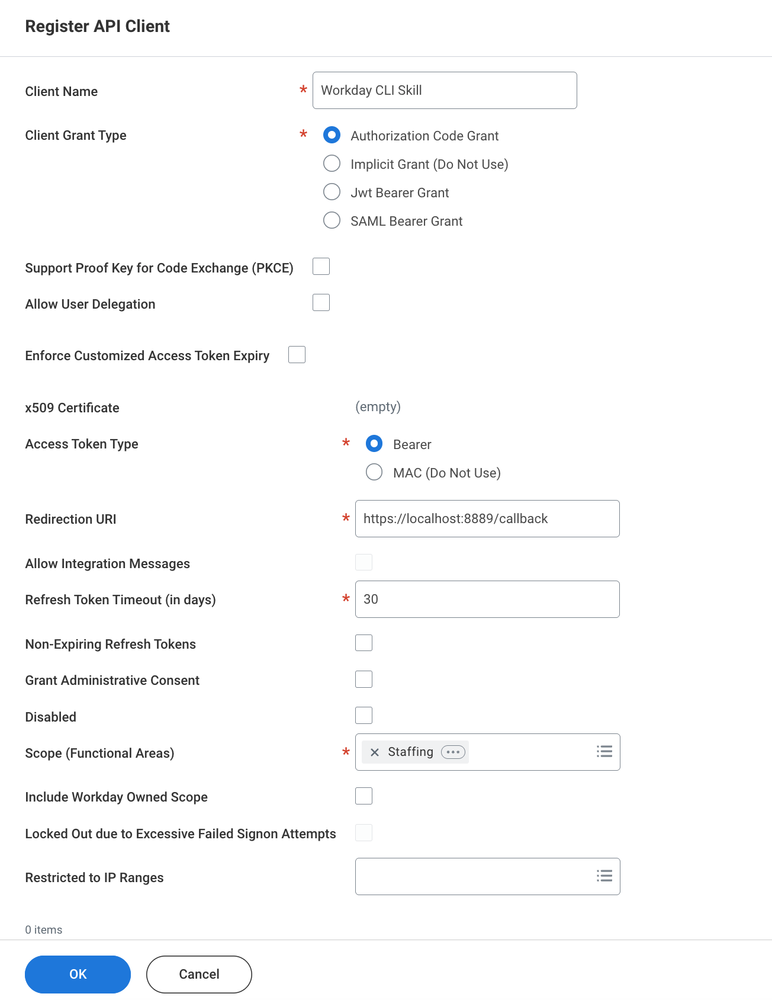

# Workday CLI

A native command-line interface for the Workday API, built to work as a Claude Code skill.

## Why a CLI?

A CLI takes a different approach. It's a single binary. It runs, does its job, and exits. There's no daemon, no server, no background process holding your tokens in memory. Claude Code can invoke it directly as a skill — same developer experience, fewer moving parts.

The CLI advantages for this use case:

- **No runtime dependencies** — one binary, no Node.js, no Python, no Docker.
- **Stateless execution** — each invocation is isolated. No connection pools to manage, no process to monitor.
- **Native OS integration** — credentials live in macOS Keychain, not in environment variables or config files passed through a server.
- **Simple distribution** — `curl | sh` and you're done.

MCP is the right tool when you need persistent connections, streaming, or complex multi-step orchestration. For hitting a REST API with proper auth, a CLI is simpler and more secure.

## Key Decisions

### Easy to Install

One command installs everything — the binary, TLS certificates, PATH configuration, and the Claude Code skill:

```sh
curl -fsSL https://raw.githubusercontent.com/favalos/workday_cli/main/install.sh | sh
```

No build tools, no manual setup.

### Security First

- **Credentials never leave your computer.** There is no server, no proxy, no third-party service in the middle. The CLI talks directly to the Workday API from your machine.
- **Tokens are stored in macOS Keychain.** Not in plaintext files, not in environment variables. The OS manages encryption and access control.
- **OAuth runs over local HTTPS.** The callback server uses locally-trusted TLS certificates via `mkcert`, so the auth flow never touches plain HTTP.
- **Automatic token refresh.** When tokens are about to expire, the CLI refreshes them transparently. No manual re-authentication unless the refresh token itself has expired.

### Claude Code Skill

The installer places a `SKILL.md` in `~/.claude/skills/workday-cli/`, so Claude Code knows how to use the CLI out of the box. Ask Claude to look up a worker, check direct reports, or find time-off data — it will call `workday_cli` for you.

## Install

```sh
curl -fsSL https://raw.githubusercontent.com/favalos/workday_cli/main/install.sh | sh
```

You may need to restart your shell after installation.

## Workday Setup

Before initializing the CLI, register an API Client in your Workday tenant with the following settings:



Key fields:
- **Client Name** — e.g. `Workday CLI Skill`
- **Client Grant Type** — `Authorization Code Grant`
- **Access Token Type** — `Bearer`
- **Redirection URI** — `https://localhost:8889/callback`
- **Scope (Functional Areas)** — select the areas you need (e.g. `Staffing`)

After saving, Workday will provide the **Authorization Endpoint**, **Token Endpoint**, **Client ID** and **Client Secret** needed for the next step.

## Initialize

After installing, authenticate with your Workday tenant:

```bash
workday_cli init \
  --auth-url https://<host>/<tenant>/authorize \
  --token-url https://<host>/<tenant>/token \
  --client-id <YOUR_CLIENT_ID> \
  --client-secret <YOUR_CLIENT_SECRET> \
  --environment <sandbox|production>
```

This opens your browser for OAuth authentication. After you log in, the CLI receives the callback, exchanges the code for tokens, and stores everything securely in Keychain.

## Help

For issues, questions, or feature requests, reach out at [github.com/favalos/workday_cli/issues](https://github.com/favalos/workday_cli/issues) or [Linkein](https://www.linkedin.com/in/favalosg/).
